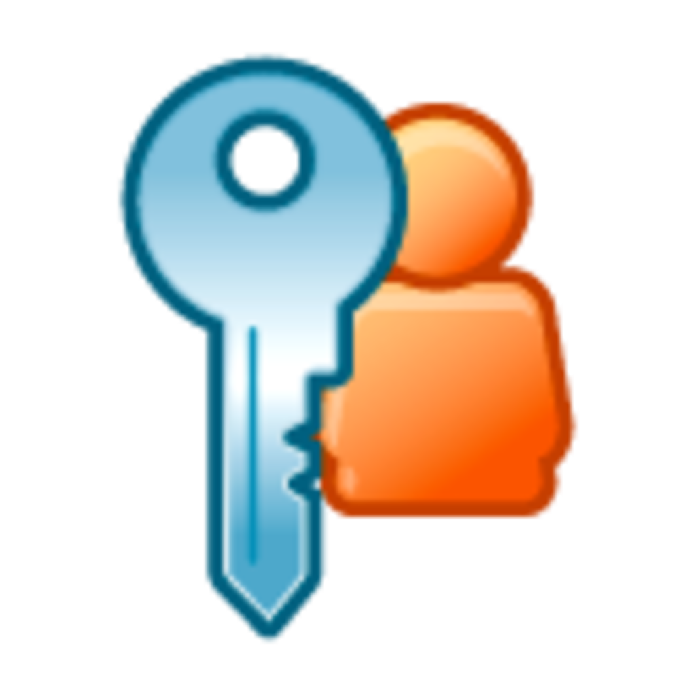

#  CipherAuth 


CipherAuth is a secure, offline-first, cross-platform password manager application designed for simplicity, security, and privacy. Built with Flutter, it provides an encrypted vault to store both your 2FA authentication tokens and passwords across Android and Windows.

**Checkout the app website for details:** [CipherAuth Website](https://cipherauth.ppriyanshu26.online)

> [!IMPORTANT]
> **License Model:** CipherAuth is source-available software (not open-source). See the [LICENSE](LICENSE) file for usage and redistribution terms.
> 
> **Privacy Policy:** See the full policy in the local [GIST.md](GIST.md) file or on [GitHub Gist](https://gist.github.com/ppriyanshu26/b9c863813ee032a9ffd9f94ff1f78aee).

---

## 📦 Releases
- Use the following buttons to get the app for your device through the official channels:

[](https://apps.microsoft.com/detail/9NS2R9NTRF2Z)
[](https://play.google.com/store/apps/details?id=in.ppriyanshu.cipherauth)

- Alternatively, for Windows devices, you can run the following command for a seamless install.

```powershell
winget install cipherauth

# Or explicitly with app id:
winget install --id 9NS2R9NTRF2Z --source msstore
```

You can also download standalone installation binaries directly from the [Releases Page](https://github.com/ppriyanshu26/CipherAuth-Flutter/releases).

---

## ✨ Features

- **Dual Vault (TOTP & Password Manager):** Manage 2FA authenticator tokens and passwords under dedicated tabs.
- **Offline-First Privacy:** Fully sandboxed offline execution. No user accounts, registration, analytics SDKs, or cloud backends.
- **AES-256-GCM Encryption:** Vault databases are encrypted using AES-256-GCM with keys derived from your Master Password via SHA-256.
- **Autofill:** Securely enter your login details on apps and websites without the effort of copy-pasting your credentials. 
- **Secure Local Sync:** Bidirectional local network sync (LAN) using a secure custom handshake protocol. Data is kept encrypted end-to-end and only decrypted if both devices have matching master passwords.
- **Biometric Authentication:** Support for Android Biometrics and Windows Hello (Fingerprint, Face unlock, or PIN code verification).
- **Auto-Lock Security:** Wipes the master password from runtime memory (`RuntimeKey`) and locks the application interface when paused or backgrounded.
- **Passphrase Generator:** Create strong, human-readable passphrases (e.g., `correct-bell-pepper-salt`) using a built-in customizable wordlist generator.
- **Screenshot Protection:** Automatic screenshot blocking and background task-switcher cover/masking on Android devices.
- **Recycle Bin:** Safeguards deleted records, retaining them for 30 days before purging. Supports instant permanent deletion.
- **QR Code Scanning & Import:** Setup accounts by scanning QR codes with your device camera, importing an image from the gallery, or opening `otpauth://` deep-links.

---

## 🛠️ Development & Compilation

CipherAuth is built with Flutter and can be compiled for any platform (iOS, Android, macOS, Linux, Windows) with minimal code changes.
> **Note:** Source visibility is provided for transparency and learning. Reuse, redistribution, and derivative standalone releases require prior written permission.

### Running from Source

1. Clone the repository.
2. Ensure you have Flutter installed. If not, follow the [Flutter installation guide](https://docs.flutter.dev/get-started/install).
3. Install dependencies:
   ```bash
   flutter pub get
   ```

4. Run the application:
   ```bash
   flutter run
   ```

### Running Android Flavors

Use these commands to run the correct Android variant:

```bash
# Production flavor
flutter run --flavor prod

# Sample/Test flavor
flutter run --flavor sample
```

### Compiling for Mobile

#### Android
```bash
flutter build apk
```
The compiled APK will be available in the `build/app/outputs/apk/` folder.

To build a specific flavor:

```bash
# Production flavor
flutter build apk --flavor prod

# Sample/Test flavor
flutter build apk --flavor sample
```

Flavor APK outputs are generated under `build/app/outputs/flutter-apk/`.

#### Windows
```bash
flutter build windows
```
The compiled Windows executable will be available in the `build/windows/x64/runner/Release/` folder.

To build an MSIX package:
```bash
dart run msix:create
```
The generated MSIX package will be available in the `build/windows/x64/runner/Release/` folder.

For detailed windows release instructions, see the [Flutter documentation](https://docs.flutter.dev/deployment/windows).

---

## ❓ FAQ

<details>
<summary><strong>How secure is CipherAuth?</strong></summary>

CipherAuth uses military-grade AES-GCM encryption to protect your credentials and maintain integrity.
</details>

<details>
<summary><strong>What are passphrases?</strong></summary>

Passphrases are sequences of random words (e.g., "correct-bell-pepper-salt") instead of traditional passwords. Because of their length, they are highly secure and extremely difficult for computers to brute-force, yet much easier to remember and type.
</details>

<details>
<summary><strong>How does autofill work?</strong></summary>

Copying passwords and pasting them poses a risk, clipboard is an open book for all the apps to read and write to. To make you secure from password thefts, CipherAuth integrates with the operating system itself, which tells the app the url of the website, and CipherAuth securely fills the credentials directly in the input fields. For browsers, change their settings to allow 3rd party apps to autofill.
</details>

<details>
<summary><strong>What is Local Sync?</strong></summary>

Since CipherAuth doesn't have a cloud server, syncing manually between every device is a pain, in sync, your devices should be on the same network and have the same password. Encrypted credentials from one device are sent over to the other, decrypted, processed, merged, and sent back again encrypted. Anyone sniffing the packets will only see a ciphertext.
</details>

<details>
<summary><strong>Is a backup csv file safe?</strong></summary>

Yes, even the csv files are encrypted and can only be decrypted by the same password it was used to encrypt. Your digital identity is completely secure and truly in your hands.
</details>

<details>
<summary><strong>What if I forget my master password?</strong></summary>

If you forget your master password, there is no way to recover your data. There are no "backdoors" or password recovery options for your security. Please ensure you keep your password in a safe place. It is highly advisable to turn on biometric protection as a backup to your master password for easier access while maintaining security.
</details>

<details>
<summary><strong>Is permanent delete applied to all my devices?</strong></summary>

No. CipherAuth has no central server to force-delete entries everywhere. Permanent delete only affects the current device. If another device still has the same credential (in the main list or its Recycle Bin), a later sync can add it back as a fresh entry. Even importing from an exported csv file can resurrect the deleted credentials.
</details>

<details>
<summary><strong>What if someone gains access to my device?</strong></summary>

All data stays encrypted locally using your master password or biometric protection; without that master password, the stored credentials are unreadable.
</details>

---

## ⚖️ License & Contributions

### License Model
CipherAuth is source-available software (not open-source) protected under copyright:
* You are permitted to view, inspect, audit, and run this source code for personal or educational purposes.
* Redistribution, rebranding, republishing modified versions, or commercial packaging of standalone builds is **strictly prohibited** without prior written consent from the copyright owner.

See the [LICENSE](LICENSE) file for more information.

### Contributions
Code contributions and bug fixes are welcome! Please submit an Issue or pull request to discuss major modifications before implementation.